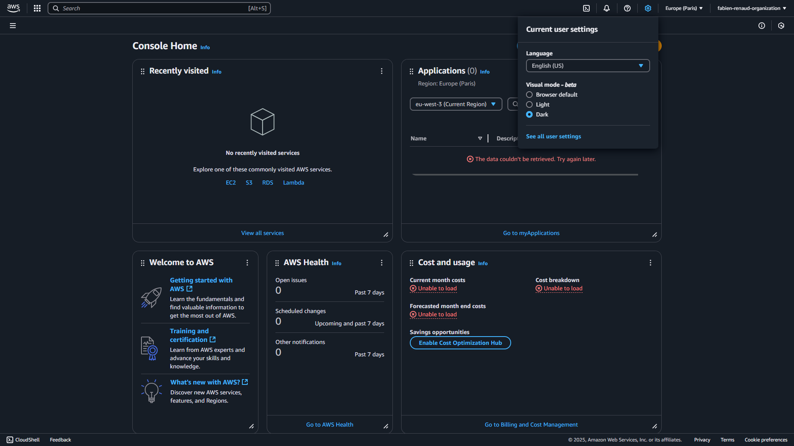
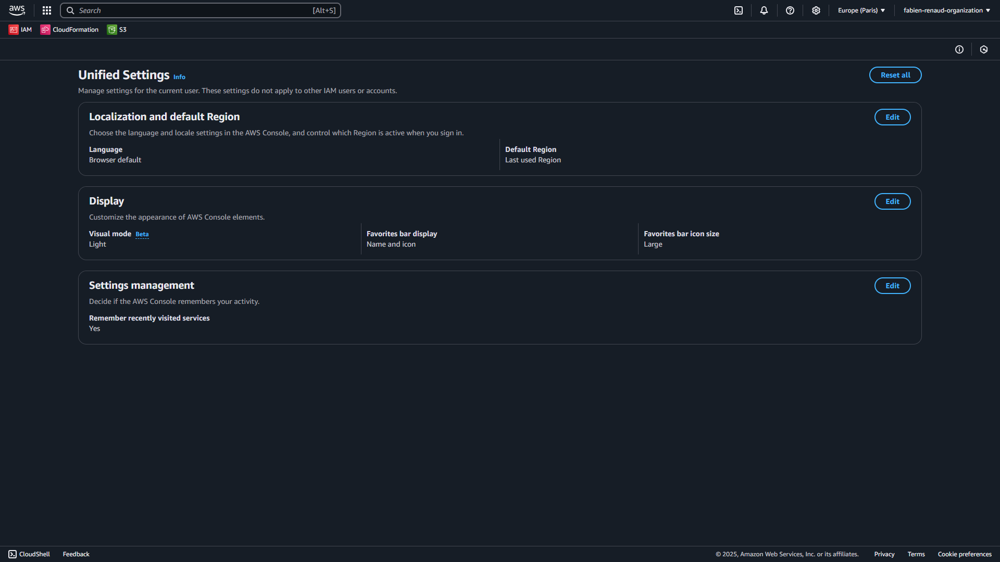
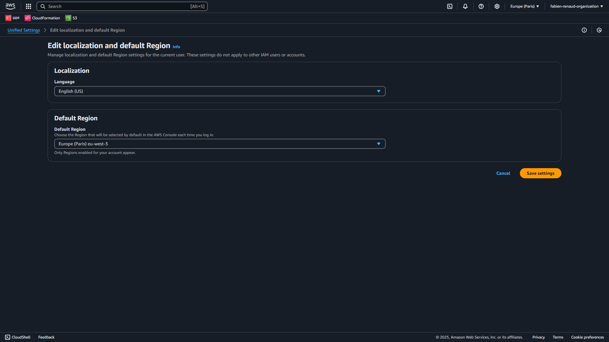
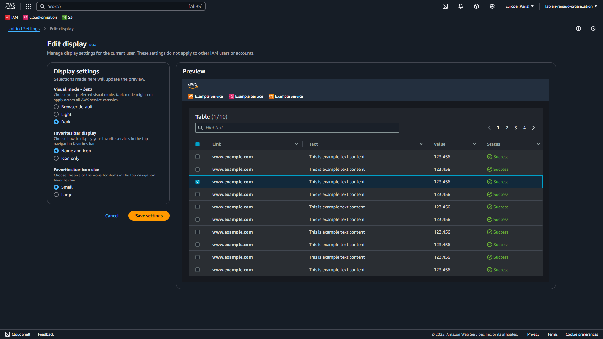

# Configure your AWS account

1. Open the console at https://console.aws.amazon.com/
2. In the upper right corner of the console, choose **Current user settings**, and then choose **See all user settings**

