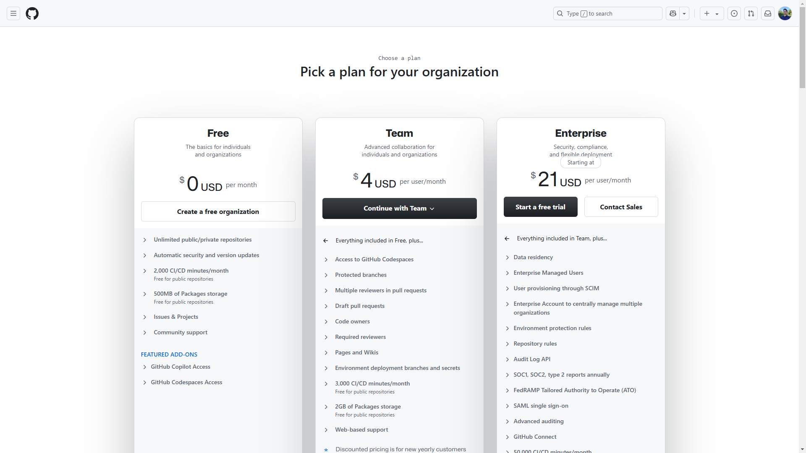
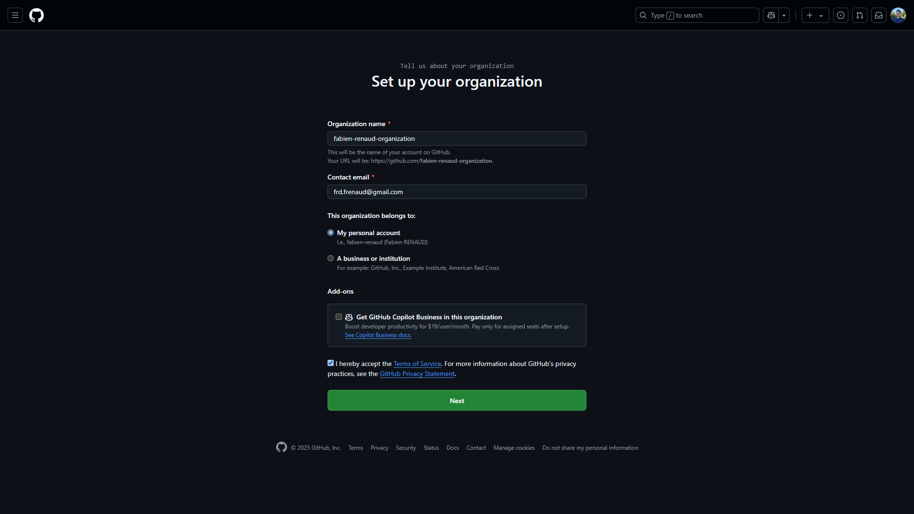
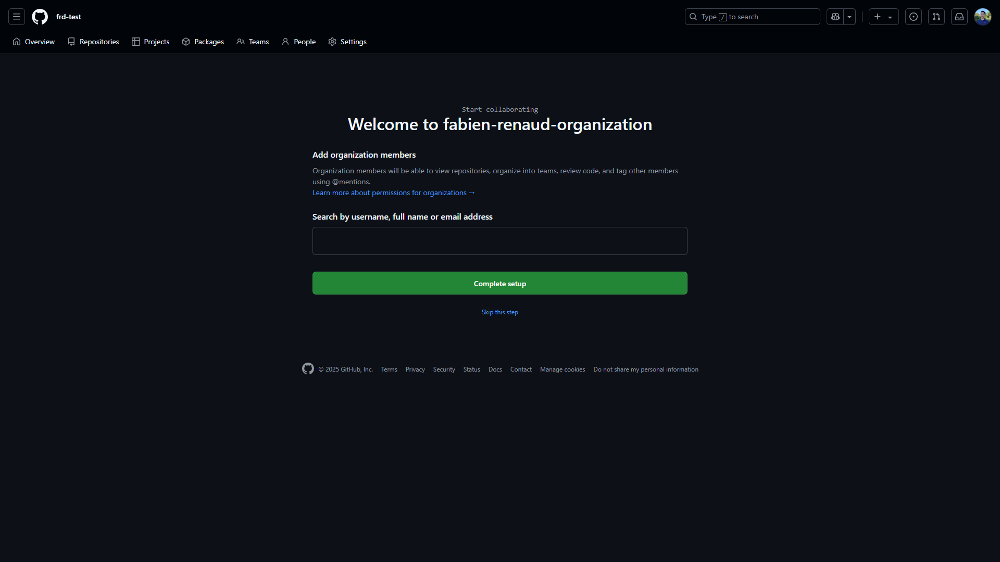
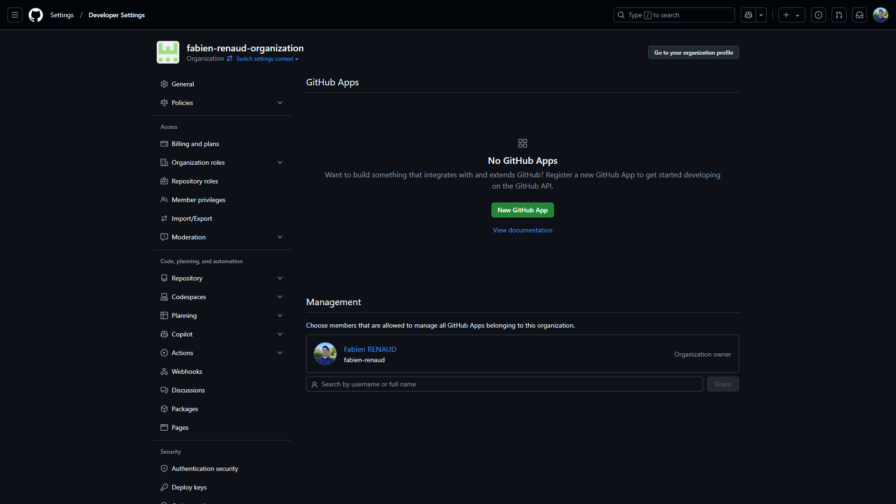
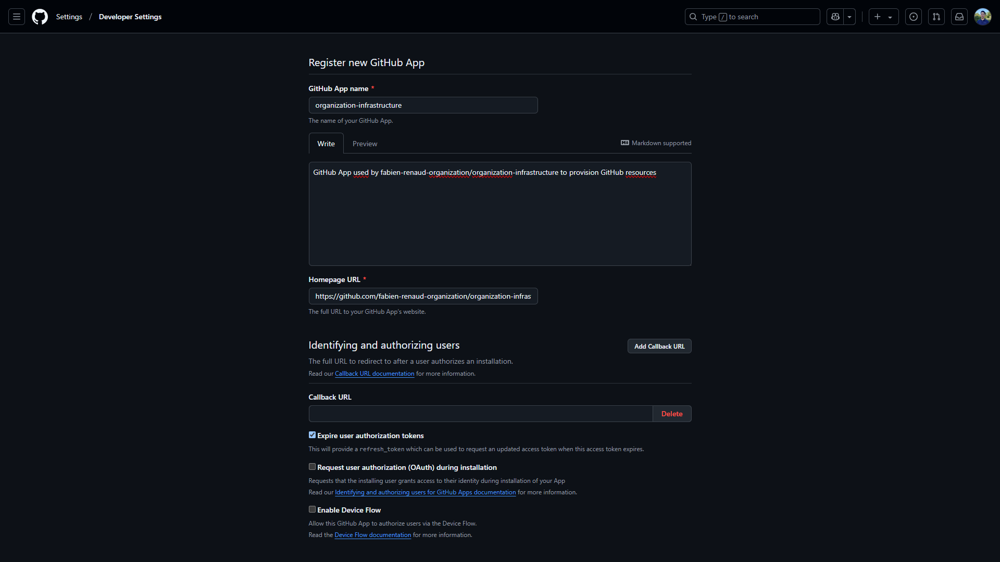
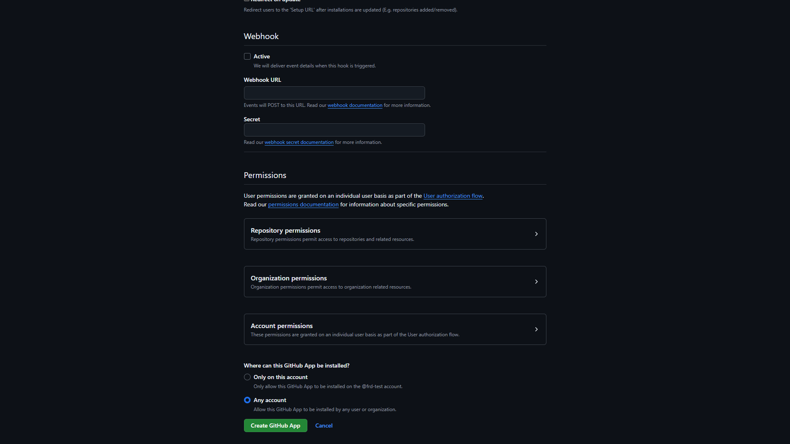
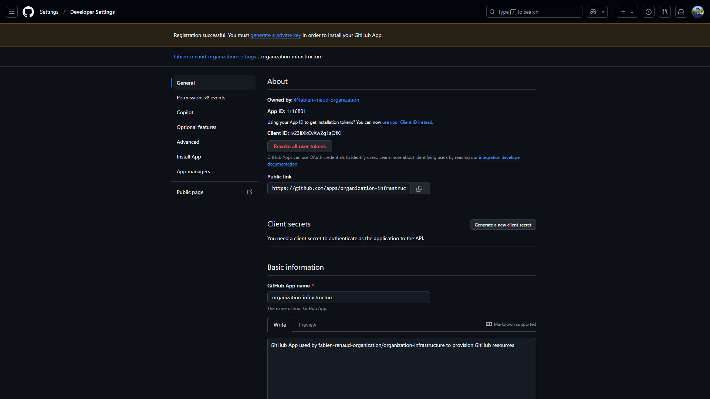
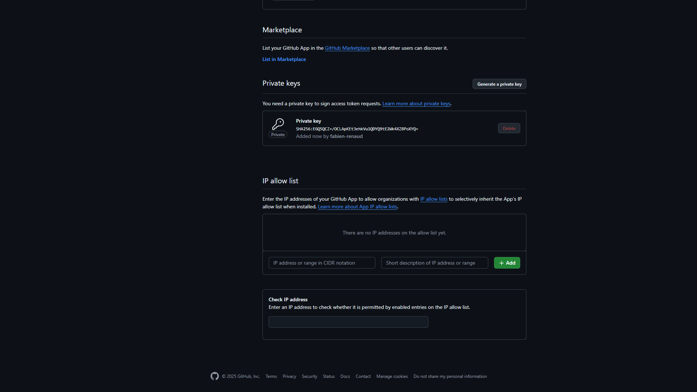
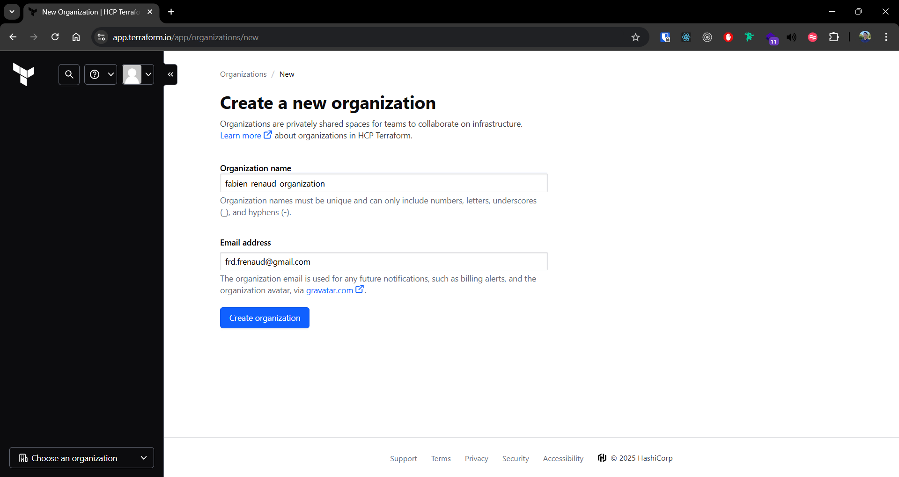

# Create a new GitHub organization

## Prerequisites

- GitHub account
- HCP Terraform account
- AWS management account

## Create GitHub organization

1. Go to https://github.com/organizations/plan , then click on `Create a free organization`

2. Fill your organization information, then click on `Next`

3. Click on `Skip this step`

## Create GitHub App

1. Go to your organization home page `https://github.com/fabien-renaud-organization`, then click on `Settings` > `Developer Settings` > `GitHub Apps` > `New GitHub App`

2. Fill your GitHub App information, then click on `Create GitHub App`

- **GitHub App name**: `organization-infrastructure`
- **Description**: `GitHub App used by fabien-renaud-organization/organization-infrastructure to provision GitHub resources`
- **Homepage URL**: `https://github.com/fabien-renaud-organization/organization-infrastructure`
- **Webhooks**: `disabled`
- **Repository permissions**:
  - **Administration:** `Read and write` # Repository creation, deletion, settings, teams, and collaborators
  - **Contents:** `Read and write`       # Repository contents, commits, branches, downloads, releases, and merges
  - **Metadata:** `Read-only`            # (Mandatory) Search repositories, list collaborators, and access repository metadata
  - **Pages:** `Read and write`          # Retrieve Pages statuses, configuration, and builds, as well as create new builds
- **Organization permissions**
  - **Administration:** `Read and write` # Manage access to an organization
  - **Members:** `Read and write`        # Organization members and teams
- **Where can this GitHub App be installed?**: `Any account`

3. Scroll down to `Private keys`, then click on `Generate a private key`

## Create HCP Terraform organization

## Create HCP Terraform project

// TODO

## Create HCP Terraform workspace

// TODO
